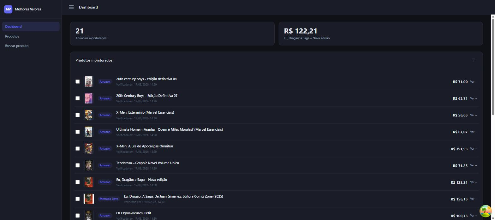
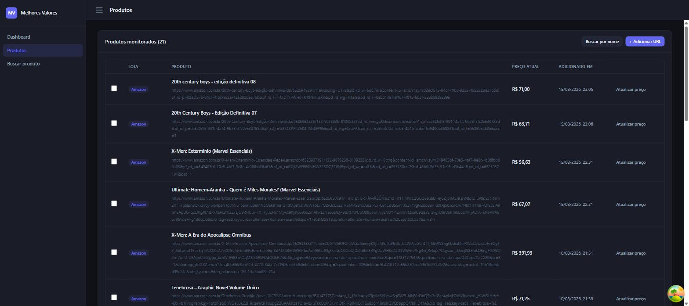
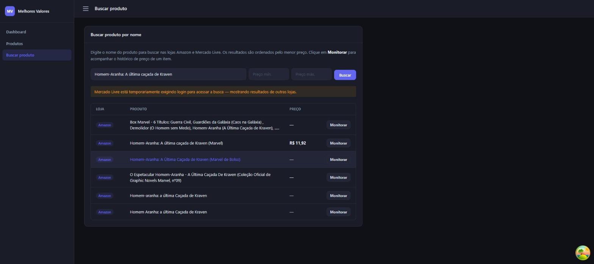
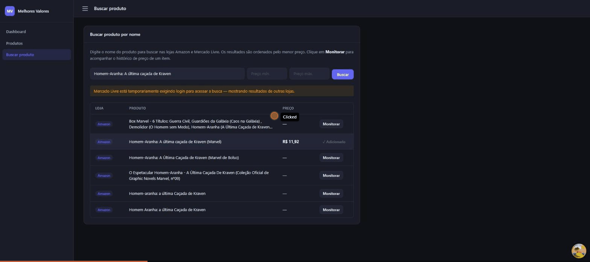

# Melhores Valores

Rastreador de preços e API de busca para plataformas de e-commerce brasileiras (Amazon BR, Mercado Livre). O sistema monitora preços automaticamente, mantém histórico e permite buscas em tempo real, utilizando uma arquitetura resiliente de web scraping.

---

## 📌 Visão Geral

O **Melhores Valores** é composto por um backend em Python (FastAPI + Celery) responsável pelo scraping, cache e persistência dos preços, e um frontend em React que consome essa API.

---

## 📸 Screenshots

**Dashboard** — visão geral dos anúncios monitorados, com preço mais baixo do dia em destaque.



**Produtos monitorados** — lista completa com URL, preço atual e atualização manual de preço.



**Busca por nome** — busca paralela em Amazon e Mercado Livre, com aviso de bloqueio por loja quando aplicável.



**Fluxo de adição** — monitorar um resultado de busca e vê-lo aparecer no Dashboard.



---

## 🛠️ Stack Tecnológica

**Backend**
- **Linguagem**: Python 3.11+
- **Framework Web**: FastAPI (API REST)
- **Banco de Dados**: PostgreSQL 15 (via Prisma ORM — interface síncrona)
- **Cache e Mensageria**: Redis 7
- **Fila de Tarefas e Agendamento**: Celery + Celery Beat
- **Web Scraping**:
  - `httpx` (requisições rápidas)
  - `Playwright/Chromium` (renderização de JS)
  - `Firecrawl API` (IA-powered scraping, usado como último recurso)
- **Infraestrutura**: Docker & Docker Compose

**Frontend**
- **React + Vite + TypeScript** (`apps/web`)
- Monorepo gerenciado com **pnpm workspaces**, com pacotes compartilhados `@mv/types` e `@mv/utils`

---

## 📂 Estrutura do Monorepo

```text
/
├── apps/web/               # Frontend React + Vite + TypeScript
├── packages/types/         # Tipos TypeScript compartilhados (@mv/types)
├── packages/utils/         # Utilitários compartilhados (@mv/utils)
├── .agents/workflows/      # Fluxos de trabalho e arquitetura detalhada
├── directives/             # Regras de negócio e SOPs (Markdown)
├── execution/               # Código fonte Python (backend)
│   ├── adapters/            # Parsers de HTML por loja
│   ├── scrapers/             # Ferramentas de requisição (httpx, playwright)
│   ├── search_scrapers/       # Scrapers específicos para páginas de busca
│   ├── web_server.py          # Endpoints FastAPI
│   ├── worker_tasks.py        # Definições de tarefas Celery
│   ├── db_client.py           # Único ponto de acesso ao banco (Prisma)
│   ├── cache_manager.py       # Lógica de cache Redis
│   └── *_orchestrator.py      # Lógica de coordenação (Search/Scraping)
├── schema.prisma            # Definição do esquema do banco de dados
├── docker-compose.yml       # Orquestração de serviços (API, Worker, Beat, DB, Redis)
├── Dockerfile                # Configuração da imagem Python
├── requirements.txt          # Dependências do backend
├── pnpm-workspace.yaml        # Definição do workspace do frontend
└── package.json               # Workspace root (scripts do frontend)
```

---

## 🏗️ Arquitetura do Projeto (3 Camadas)

O backend segue uma arquitetura de 3 camadas para separar regras de negócio, coordenação e execução técnica:

1. **Diretivas** (`/directives`) — SOPs em Markdown com regras de cache, padrões de adapters, estratégias de scraping, etc.
2. **Orquestradores** (`execution/*_orchestrator.py`, `execution/worker_tasks.py`) — Lógica de decisão que coordena o fluxo entre as ferramentas (ex: qual nível do cascading scraping usar, agregação de buscas multi-loja).
3. **Execução** (`execution/`) — Módulos determinísticos e focados: adapters por loja, scrapers, acesso ao banco (`db_client.py`), cache (`cache_manager.py`).

---

## 🚀 Como Rodar o Projeto

### Pré-requisitos

- [Docker](https://www.docker.com/) & Docker Compose (fluxo principal do backend)
- Node.js >= 20
- pnpm >= 9
- Python 3.11+ (apenas se for rodar o backend sem Docker)

### Backend — via Docker (recomendado)

```bash
docker-compose up -d          # Sobe db, redis, api, worker e beat
docker-compose logs -f api    # Acompanha logs da API
docker-compose logs -f worker # Acompanha logs do Celery worker
docker-compose down           # Para todos os serviços
```

Serviços disponíveis:
| Serviço | Descrição | Porta |
|---|---|---|
| `db` | PostgreSQL 15 | 5432 |
| `redis` | Redis 7 (cache + broker Celery) | 6379 |
| `api` | FastAPI | 8000 |
| `worker` | Celery worker (2 tarefas concorrentes) | - |
| `beat` | Celery Beat (agenda `schedule_all_products` a cada 6h) | - |

### Backend — local, sem Docker

```bash
pip install -r requirements.txt

prisma generate                             # Gera o client Prisma
prisma migrate dev --name <nome_da_migracao> # Aplica o schema no banco

uvicorn execution.web_server:app --host 0.0.0.0 --port 8000 --reload
celery -A execution.worker_tasks worker --loglevel=info
celery -A execution.worker_tasks beat --loglevel=info
```

### Frontend

```bash
pnpm install   # Instala dependências de todo o workspace (raiz do repo)
pnpm dev       # Inicia o servidor de desenvolvimento (porta 3000)
pnpm build     # Build de produção
pnpm preview   # Preview do build de produção
```

O frontend fica em `apps/web` (pacote `@mv/web`) e depende dos pacotes compartilhados `packages/types` e `packages/utils`.

---

## 🔐 Variáveis de Ambiente

### Backend (`.env` na raiz)

Copie o arquivo `.env.example` para `.env` e preencha os valores:

```bash
cp .env.example .env
```

### Frontend (`apps/web/.env.example`)

```env
VITE_API_URL=http://localhost:8000
```

---

## 🌐 Principais Endpoints da API

| Método | Rota | Descrição |
|---|---|---|
| `GET` | `/health` | Health check |
| `POST` | `/monitor/add` | Adiciona uma URL de produto para monitoramento de preço |
| `GET` | `/history/{product_id}` | Retorna o histórico de preços de um produto |
| `POST` | `/search` | Dispara uma busca multi-loja (Amazon + Mercado Livre) e retorna um `search_id` |
| `GET` | `/search/{search_id}` | Retorna os resultados da busca, ordenados por menor preço |

### Fluxo: Monitoramento de Preços (Cascading Scraping)

```
POST /monitor/add {"url": "..."}
  → detecta a loja → enfileira tarefa no Celery
  → Worker: verifica cache no Redis (TTL de 2h)
  → Cache miss: cascata de scraping em 3 níveis:
      1. httpx (rápido, gratuito)
      2. Playwright/Chromium (mais lento, gratuito)
      3. Firecrawl API (pago, último recurso)
  → Roteia para o adapter da loja (amazon/mercadolivre)
  → Salva no PostgreSQL via Prisma → atualiza cache no Redis
```

### Fluxo: Busca de Produtos

```
POST /search {"query": "iPhone 15"}
  → enfileira task_search_products()
  → Search Orchestrator: busca em paralelo em Amazon + Mercado Livre
  → Agrega resultados → salva na tabela SearchResult
  → retorna search_id

GET /search/{search_id} → retorna resultados ordenados por preço ASC
```

---

## 🔐 Modelos de Dados (Prisma)

- **Product**: informações básicas do produto (nome, loja, URL, imagem).
- **PriceHistory**: cada variação de preço capturada, com timestamp.
- **SearchResult**: cache temporário de buscas realizadas pelos usuários.

---

## 🚦 Regras Críticas de Desenvolvimento

- **Acesso ao Banco**: apenas via `execution/db_client.py`. Nunca chame o Prisma Client diretamente em outros módulos.
- **Sincronicidade**: o Prisma está configurado como síncrono; não use `async/await` em chamadas de banco.
- **Resiliência**: sempre priorize o cache e os scrapers gratuitos antes de escalar para o Firecrawl.
- **Isolamento**: cada loja tem seu próprio Adapter, para facilitar a manutenção em caso de mudança de layout no site.
